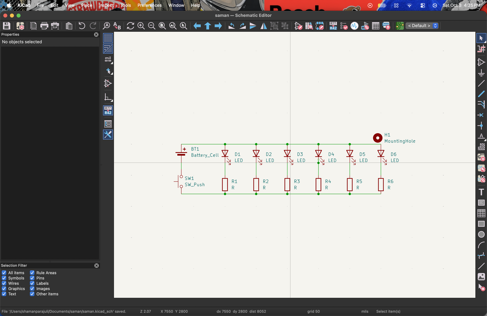
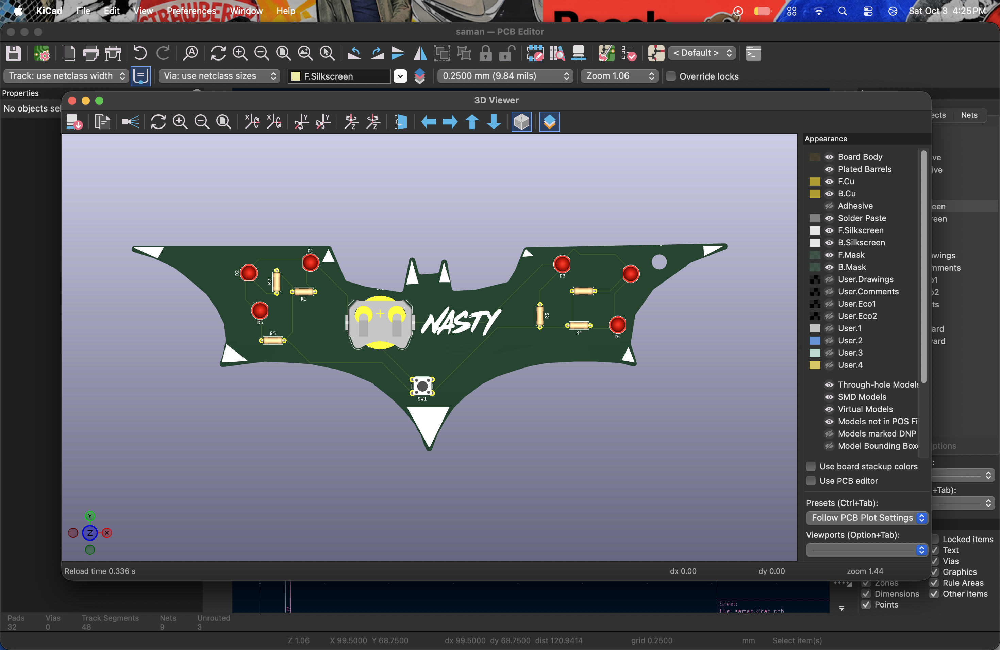
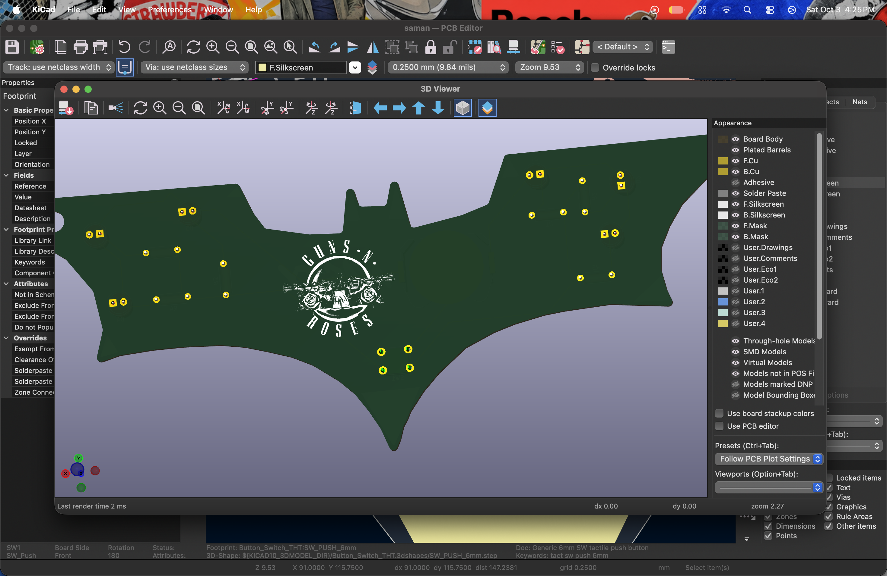
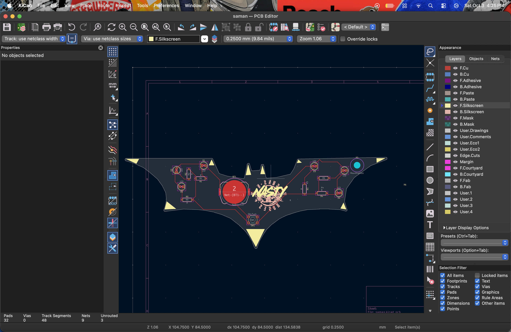

# Batman_blinky_pcb

I made a pcb with a shape of batman logo with the art of guns and roses and also with a slang NASTY. In this pcb i have used 6 leds and 6 resistor with a battery holder and also with a switch and with a holding mount for the keychain.

## Schematic

## PCB

## How to build
 order the PCB & components, open up the KiCAD file and build it accordingly.

## BOM
- 1 	Battery holder
- 6	470ohms Resistor
- 1 	Push Button
- 6 LEDs

Made by Saman

Made as a part of http://solder.hackclub.com/!
